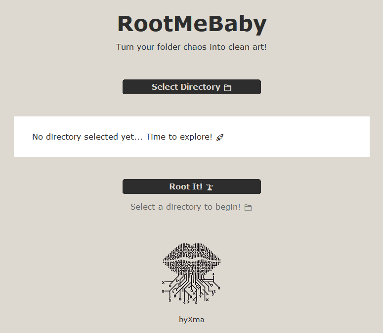

# RootMeBaby

[](https://opensource.org/licenses/MIT)
[](https://www.python.org/downloads/)
[](https://opensource.org/)

A modern, stylish directory tree generator with a clean GUI interface. RootMeBaby helps you visualize your project structures and directory hierarchies in a beautiful ASCII tree format.



## ✨ Features

- **Clean UI**: Sleek interface with intuitive controls
- **Smart Directory Scanning**: Automatically excludes common system directories and hidden files
- **ASCII Tree Generation**: Creates clean directory trees in text format
- **User-Friendly**: Simple two-click process to generate your directory tree
- **Customizable Output**: Saves the tree structure in an easily readable format

## 🚀 Getting Started

### Prerequisites

- Python 3.6 or higher
- pip (Python package installer)

### Installation

1. Clone the repository

```bash
git clone https://github.com/xmal0c/RootMeBaby.git
cd RootMeBaby
```

2. Install required packages

```bash
pip install pillow
```

### Usage

1. Run the application:

```bash
python main.py
```

2. Click "Select Directory" to choose your root directory
3. Click "Root It!" to generate the tree
4. Find your generated tree in `RootMeBaby_tree.txt` in the selected directory

## 📁 Project Structure

```
RootMeBaby/
├── main.py                 # Main application file
├── tree_generator/         # Core tree generation logic
│   ├── __init__.py
│   ├── generator.py        # Tree generation algorithm
│   └── file_utils.py      # File handling utilities
├── assets/                 # Application assets
│   ├── style.py           # UI styling configurations
│   └── logo.jpg           # Application logo
└── README.md
```

## 🎨 Output Example

```
my_project/
├── docs/
│   ├── api.md
│   └── setup.md
├── src/
│   ├── main.py
│   └── utils.py
└── README.md
```

## 🛠️ Technical Details

- Built with Python's tkinter for the GUI
- Uses custom tree generation algorithm
- Implements modern UI patterns
- Handles large directory structures efficiently
- Excludes system and hidden files by default

## 🤝 Contributing

Contributions are welcome! Feel free to:

- Report bugs
- Suggest features
- Submit pull requests

## 📝 License

This project is open-source and free for everyone! Licensed under the MIT License.

Feel free to:

- ✅ Use it in your projects
- ✅ Modify it
- ✅ Share it with others
- ✅ Use it commercially
- ✅ Distribute your modified versions

Just remember to include the license text and copyright notice when you share or modify the code! See the [LICENSE](LICENSE) file for the full terms. 😊

## 🙏 Acknowledgments

- Developed by [xMal0c](https://github.com/xmal0c)
- Inspired by the need for a modern, user-friendly directory tree generator

## 📬 Contact

- GitHub: [@xMal0c](https://github.com/xmal0c)

---

Made with ❤️ by xMal0c
